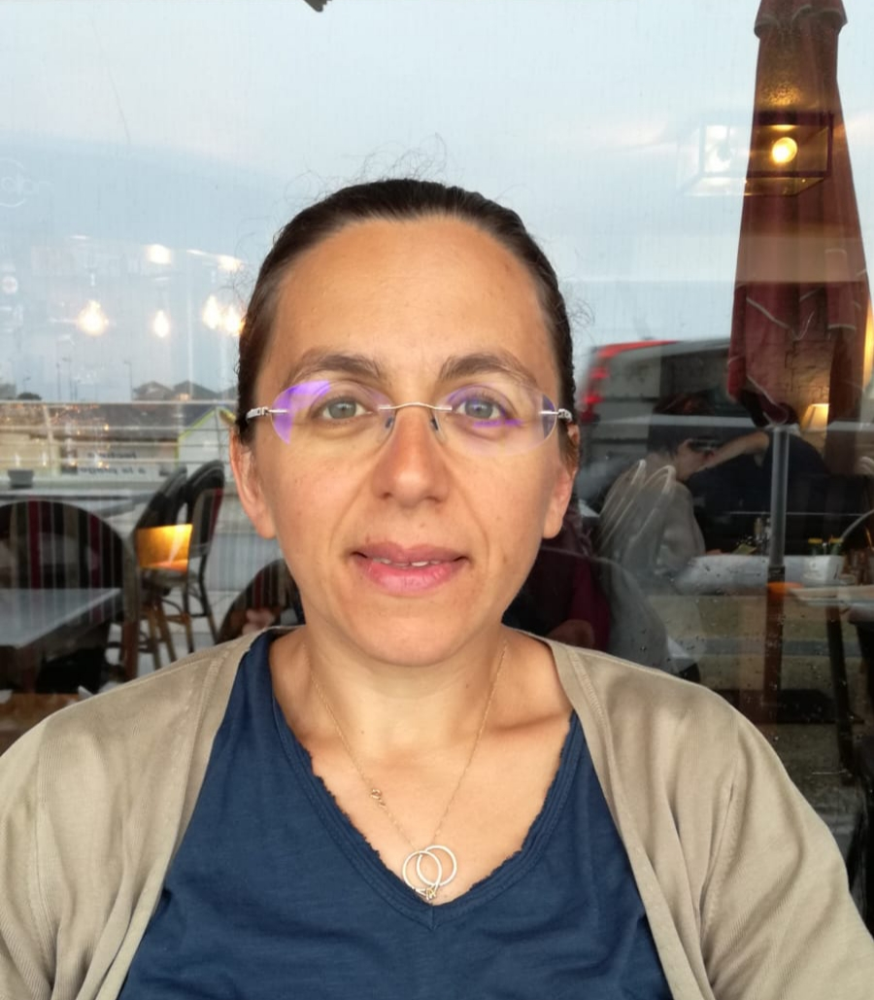

I am an INSERM researcher in bioinformatics and genomics, leading the [BRIDGe (Bioinformatics Research In Disease Genetics)](http://www.irsd.fr/equipe-4--bioinformatics-research-in-disease-genomics.html) team of IRSD, together with [Jean Monlong].(https://jmonlong.github.io/) 

Interested in the functional annotation of genomes through the use of NGS (Next Generation Sequencing) omics data, I am doing both method development and data analysis.

As I was one of the main analysts of the [first really comprehensive human NGS transcriptomic dataset](https://www.nature.com/articles/nature11233) (long/small, polyadenylated/non polyadenylated RNAs from 15 different cell lines and 6 different cell compartments, using RNA-seq/CAGE/RNA-PET NGS techniques), my first expertise lies in RNA-seq data analysis (see also, in terms of method development, [ChimPipe](https://github.com/Chimera-tools/ChimPipe) for chimeric transcript identification).

Since 2015 and my involvement in the [INRAE FR-AgENCODE project](https://www.fragencode.org/) on livestock species, I have gained interest in regulatory genomics and in particular in the identification of enhancer/gene relationships, as I think they can be tremendously important in the context of complex traits, both for livestock and for human.

This is a complex question and although many methods exist there is no consensus about which one performs best. In fact we have shown that depending on the kind of reference data used to evaluate the methods (3D data, eQTL data or genetic screening data), [the best method could be drastically different](https://pubmed.ncbi.nlm.nih.gov/36909938/).

For now, I would like to focus on the enhancer/gene relationships that can be obtained using chromatin conformation (3D) data, and their evolution with time, using comparative genomics on different vertebrate species.

Coming back to the original question of many international functional annotation consortia I was a member of (ENCODE, mouseENCODE, FANTOM, GTEx), I would like to use enhancer/gene relationships of cell types related to a given polygenic human disease, to better fine-map the variants associated to this disease. In this context, we have recently developed [PaintorPipe](https://github.com/sdjebali/PaintorPipe) to fine-map causal variants of human traits based on GWAS summary statistics data and on functional annotations. 

